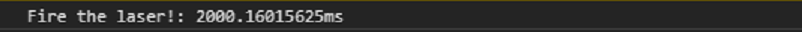

### Timers

```javascript
console.time("Fire the laser!");
setTimeout(() => {
    console.timeEnd("Fire the laser!");
}, 2000);
```



Notes:
Timers will also add an annotation to the performance timeline.
