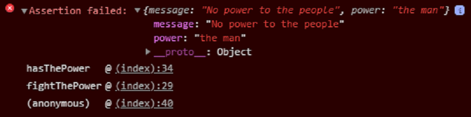

### Assertions

```javascript
var power = "the man";
console.assert(power === "the people", {
    "message": "No power to the people",
    "power": power
});
```



Notes:
Assert can be called with or without a label.