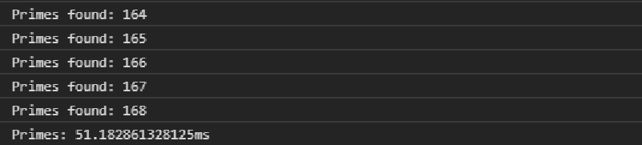

### Hit Counts

```javascript
function isPrime(value) {
    // Blazing fast prime check
}

console.time("Primes");
for (var i = 2; i < 1000; i++) {
    if (isPrime(i)) {
        console.count("Primes found"); // <--
    }
}
console.timeEnd("Primes");
```



Notes:
Can be called with or without a label.