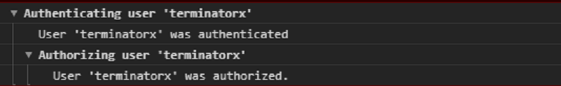

### Organizing output

```javascript
var user = "terminatorx", authenticated = true, authorized = true;
// console.groupCollapsed("Authenticating user '%s'", user);
console.group("Authenticating user '%s'", user);
if (authenticated) {
    console.log("User '%s' was authenticated", user);
    console.group("Authorizing user '%s'", user);
    if (authorized) {
        console.log("User '%s' was authorized.", user);
    }
    console.groupEnd();
}
console.groupEnd();
```



 <!-- .element class="fragment fade-in" data-fragment-index="2" -->

Notes:
Use to group related messages and reduce clutter.
Grouping things simply indents output until groupEnd.