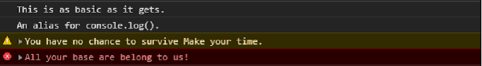

### Constant Strings

```javascript
console.log("This is as basic as it gets.");
console.info("An alias for console.log().");
console.warn("You have no chance to survive Make your time.");
console.error("All your base are belong to us!");
```



Notes:
There are four different ways of outputting text to the console. They all work the same way except they have different severities. You can filter by severity and the differing colors can help them stand out.
Warn and error also show a stack trace.