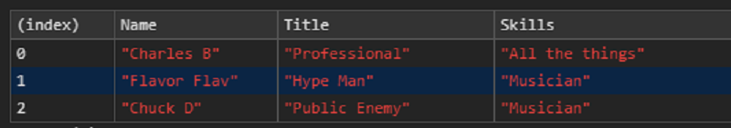

### Tables 

```javascript
    // Magic to get data from some place.
    const people = [
        { "Name": "Charles B", "Title": "Professional", "Skills": ["All the things"] },
        { "Name": "Flavor Flav", "Title": "Hype Man", "Skills": ["Musician", "Television"] },
        { "Name": "Chuck D", "Title": "Public Enemy", "Skills": ["Musician"] }
    ];

    console.log(people); // Not helpful...

    console.table(people);
```


 <!-- .element class="fragment" -->

Notes:
Tables are sortable by column.
Console.table() can only handle 1000 rows.